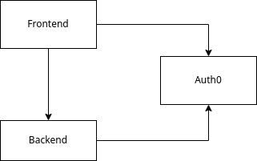

# Dokumentation

### Welche Technologien werden verwendet?
Im Frontend wird React mit Typescript, ChakraUI, React-Query, Aspida, Auth0 verwendet.
Im Backend haben wir NestJS und die Auth0 Library verwendet.  
### Eine Übersicht über die Komponenten der App (Komponenten-Diagramm)

### (Lian) Welche Anforderungen wurden umgesetzt?
### Eine Anleitung, wie die Entwicklungsumgebung eingerichtet werden kann/muss
#### Welche Tools benötigt man?
* git
* npm
* Node v14.16.0
1. Clone Frontend and Backend
```sh
git clone https://github.com/scouts-talentpool/frontend
git clone https://github.com/scouts-talentpool/backend
```
2. Install Dependencies
```sh
frontend $ npm i
```
```sh
backend $ npm i
```
3. Setup .env
4. Run
```sh
frontend $ npm run dev
```
```sh
backend $ npm run dev
```
#### Auth0 (Lian)
#### Environment
##### Frontend .env
```sh
VITE_AUTH0_DOMAIN=
VITE_AUTH0_CLIENT_ID=
VITE_API_URL=
```
##### Backend .env
```sh
DATABASE_URL=
AUTH0_DOMAIN=
AUTH0_CLIENT_ID=
AUTH0_CLIENT_SECRET=
AUTH0_USER_DATABASE=
AUTH0_AUDIENCE=http://localhost:2030
NODE_ENV="development"
```
#### Kontaktdaten: an wen kann sich Stefan bei Problemen wenden?
* Kris Huber <kris@krishuber.xyz>
* Lian Studer <ln.studer@protonmail.ch>
